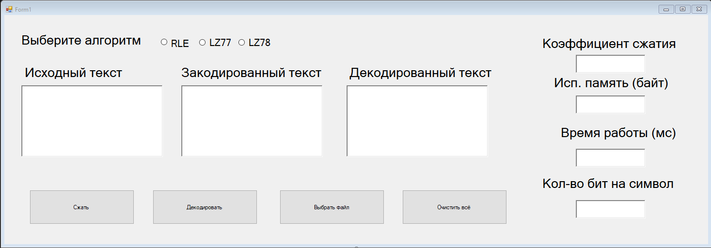

# 📦 Программа для сжатия текстовых данных (RLE, LZ77, LZ78)

## 🖥️ Описание интерфейса

В данном приложении были реализованы и представлены в виде интуитивно понятного графического интерфейса для сжатия и декодирования текстовых данных с использованием классических алгоритмов:  
**Run-Length Encoding (RLE)**, **LZ77** и **LZ78**.

## 🚀 Возможности

- Выбор одного из трёх алгоритмов сжатия.
- Ввод исходного текста вручную или загрузка из файла.
- Отображение закодированного текста.
- Декодирование обратно в исходный вид.
- Автоматический расчёт:
  - **Коэффициента сжатия**
  - **Использованной памяти (в байтах)**
  - **Времени выполнения (в миллисекундах)**
  - **Среднего количества бит на символ**

## 🔘 Элементы интерфейса

- **Выбор алгоритма:** переключатели RLE / LZ77 / LZ78
- **Текстовые поля:**
  - Исходный текст
  - Закодированный текст
  - Декодированный текст
- **Кнопки:**
  - `Сжать` — запускает алгоритм сжатия
  - `Декодировать` — восстанавливает оригинальный текст
  - `Выбрать файл` — загружает текст из файла
  - `Очистить всё` — сбрасывает содержимое всех полей
- **Результаты анализа:**
  - `Коэффициент сжатия`
  - `Исп. память (байт)`
  - `Время работы (мс)`
  - `Кол-во бит на символ`

## 📂 Как использовать

1. Введите или загрузите исходный текст.
2. Выберите нужный алгоритм.
3. Нажмите кнопку **Сжать**.
4. Результаты появятся в правой части интерфейса.
5. Для проверки корректности декодирования нажмите **Декодировать**.

## 🛠️ Технологии

- Язык: C#
- Платформа: Windows Forms

## 📈 Назначение

Программа идеально подходит для учебных целей, демонстрации принципов работы алгоритмов сжатия, а также для анализа эффективности различных методов.
